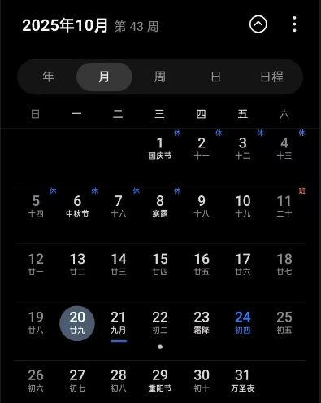

# Jcalendar 📅(Building...)

<div align="center">

📅📅📅

**一个优雅的跨平台日历应用**

支持 iOS · Android · Web

[](LICENSE)
[](https://expo.dev)
[](https://reactnative.dev)

[功能特性](#-功能特性) · [快速开始](#-快速开始) · [截图预览](#-截图预览) · [技术栈](#️-技术栈) · [开发指南](#-开发指南)

</div>

---

## ✨ 功能特性

### 已实现功能

- 🗓️ **多视图模式**

  - 月视图：完整的月历显示，支持左右滑动切换
  - 周视图 / 日视图 / 年视图 / 日程视图（开发中）

- 🌙 **中国特色**

  - 农历日期显示（初一显示月份，其他显示日期）
  - 中国法定节假日标注（国庆节、春节等）
  - 完整支持中文界面

- 🎨 **精致体验**

  - 深色模式自动适配
  - 流畅的视图切换动画
  - 优雅的 iOS/Android 原生风格设计

- ⚡ **性能优化**
  - 视图缓存机制（切换不重新渲染）
  - 虚拟化列表（FlatList 优化）
  - 月份预加载（前后月提前渲染）

### 计划功能

- [ ] 事件管理（创建、编辑、删除）
- [ ] 事件提醒与通知
- [ ] 日历数据导入导出
- [ ] 系统日历同步
- [ ] 自定义主题颜色
- [ ] 多语言支持

---

## 🚀 快速开始

### 环境要求

- Node.js 18+
- npm 或 yarn
- iOS 开发需要 Xcode 和 CocoaPods
- Android 开发需要 Android Studio

### 安装运行

```bash
# 1. 克隆仓库
git clone git@github.com:jet-isnt-haha/Jcalendar.git
cd jcalendar

# 2. 安装依赖
pnpm install

# 3. 启动开发服务器
pnpm expo start

# 4. 在模拟器或真机上运行
# - 按 i 打开 iOS 模拟器
# - 按 a 打开 Android 模拟器
# - 按 w 在浏览器中打开
# - 扫描二维码在 Expo Go 中打开
```

---

## 📸 截图预览

<div align="center">

|                       月视图（浅色）                        |                       月视图（深色）                       |
| :---------------------------------------------------------: | :--------------------------------------------------------: |
|  |  |

</div>

---

## 🛠️ 技术栈

### 核心技术

- **React Native 0.81** - 跨平台移动应用框架
- **Expo 54** - React Native 开发工具链
- **Expo Router 6** - 文件系统路由
- **TypeScript 5** - 类型安全
- **NativeWind 4** - Tailwind CSS for React Native

### 关键依赖

| 库                                                                             | 用途             |
| ------------------------------------------------------------------------------ | ---------------- |
| [date-fns](https://date-fns.org/)                                              | 日期计算和格式化 |
| [solarlunar-es](https://github.com/yize/solarlunar)                            | 农历转换         |
| [date-holidays](https://github.com/commenthol/date-holidays)                   | 节假日查询       |
| [react-native-reanimated](https://docs.swmansion.com/react-native-reanimated/) | 高性能动画       |
| [@expo/vector-icons](https://icons.expo.fyi/)                                  | 图标库           |

---

## 📂 项目结构

```
Jcalendar/
├── app/                      # 🗂️ 路由页面（Expo Router）
│   ├── (tabs)/              # Tab 导航
│   │   ├── index.tsx        # 首页（日历主界面）
│   │   └── setting.tsx      # 设置页
│   ├── event/               # 事件相关页面（模态）
│   │   ├── [id].tsx         # 事件详情
│   │   ├── create.tsx       # 创建事件
│   │   └── edit/[id].tsx    # 编辑事件
│   └── _layout.tsx          # 根布局
│
├── src/
│   ├── components/          # 📦 可复用组件
│   │   └── calendar/
│   │       ├── CalendarHeader.tsx  # 顶部标题栏
│   │       ├── ViewTabs.tsx        # 视图切换 Tab
│   │       ├── MonthView.tsx       # 月视图
│   │       └── DateCell.tsx        # 日期单元格
│   │
│   ├── hooks/               # 🪝 自定义 Hooks
│   │   └── useViewCache.ts  # 视图缓存管理
│   │
│   ├── utils/               # 🔧 工具函数
│   │   └── dateHelper.ts    # 日期处理（周数、农历、节假日）
│   │
│   ├── contexts/            # 🌐 React Context
│   │   └── ThemeContext.tsx # 主题管理
│   │
│   └── styles/              # 🎨 样式配置
│       └── theme.ts         # 主题颜色定义
│
├── assets/                  # 🖼️ 静态资源
│   └── images/
│
├── app.json                 # Expo 配置
├── tailwind.config.js       # Tailwind 配置
└── package.json
```

---

## 👨‍💻 开发指南

### 代码风格

本项目使用 ESLint 和 Prettier 保证代码质量：

```bash
# 检查代码规范
pnpm run lint

# 自动修复
pnpm run lint --fix
```

### Git 提交规范

遵循 [Conventional Commits](https://www.conventionalcommits.org/)：

```
feat: 新功能
fix: 修复 Bug
docs: 文档更新
style: 代码格式调整
refactor: 重构
perf: 性能优化
test: 测试相关
chore: 构建/工具链配置
```

---

## 📖 文档

- [开发文档](./DEVELOPMENT.md) - 详细的架构设计和技术实现

---

## 📄 许可证

本项目采用 [MIT License](LICENSE) 开源协议。

---

## 📮 联系方式

- **作者**: jet-isnt-haha
- **GitHub**: [@jet-isnt-haha](https://github.com/jet-isnt-haha)

---

<div align="center">

**Welcome ⭐ Star ！**

</div>
